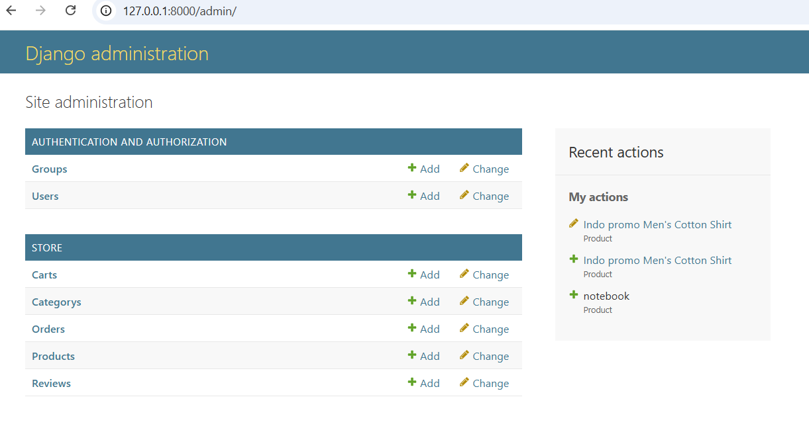

# 🛒 E-Commerce Website | DevOps Project

## 📌 Project Overview

A cloud-ready E-Commerce application built with Django and deployed using modern DevOps practices. This project demonstrates CI/CD automation, containerization, cloud deployment, and infrastructure management.

---

## 🏗️ Architecture

GitHub → Jenkins → Docker → AWS EC2 → Django Application

### Workflow

1. Developer pushes code to GitHub.
2. Jenkins automatically triggers the pipeline.
3. Application is built and tested.
4. Docker image is created.
5. Application is deployed on AWS EC2.
6. Users access the application through a web browser.

---

## 🚀 Features

### User Features

* User Registration & Login
* Email Verification
* Product Search
* Product Categories
* Shopping Cart
* Order Placement
* Order History
* Product Reviews

### Admin Features

* Product Management
* Category Management
* Order Management
* User Management

---

## 🛠️ Tech Stack

### Backend

* Python
* Django

### Database

* SQLite3

### DevOps

* Git
* GitHub
* Jenkins
* Docker

### Cloud

* AWS EC2

### Operating System

* Ubuntu Linux

---

## 📂 Project Structure

```text
E-Commerce-Website/
├── Ecommerce/
├── store/
├── accounts/
├── screenshot/
├── manage.py
├── requirements.txt
├── Dockerfile
├── Jenkinsfile
└── README.md
```

---

## ⚙️ Installation

### Clone Repository

```bash
git clone https://github.com/ganesh939259-dotcom/E-Commerce-Website.git
cd E-Commerce-Website
```

### Create Virtual Environment

```bash
python -m venv venv
```

### Activate Environment

```bash
source venv/bin/activate
```

### Install Dependencies

```bash
pip install -r requirements.txt
```

### Apply Migrations

```bash
python manage.py migrate
```

### Run Server

```bash
python manage.py runserver
```

---

## 🐳 Docker Deployment

### Build Image

```bash
docker build -t ecommerce-app .
```

### Run Container

```bash
docker run -d -p 8000:8000 ecommerce-app
```

---

## 🔄 CI/CD Pipeline

### Jenkins Stages

* Source Code Checkout
* Dependency Installation
* Django Migration
* Docker Build
* Docker Run
* Deployment Verification

---

## ☁️ AWS Deployment

### Services Used

* AWS EC2
* Security Groups
* Ubuntu Server

### Deployment Steps

* Launch EC2 Instance
* Install Docker & Jenkins
* Clone Repository
* Configure CI/CD Pipeline
* Deploy Application

---

# 🛒 E-Commerce Website

## Live Demo

🌐 Live Application: http://3.109.137.208/
🌐 Live Application admin :https://127.0.0.1:8000/

## Source Code

🔗 GitHub Repository:
https://github.com/ganesh939259-dotcom/E-Commerce-Website

## 📸 Screenshots

### Home Page


### Login Page


### Product Page


### Cart Page


### Admin Dashboard



---

## 🎯 Future Enhancements

* Kubernetes Deployment
* Terraform Infrastructure
* Monitoring with Prometheus
* Grafana Dashboards
* Payment Gateway Integration

---

## 👨‍💻 Author

**Nangili Ganesh**

GitHub: https://github.com/ganesh939259-dotcom

LinkedIn: https://www.linkedin.com/in/nangili-ganesh-8b1a02262/

---

## ⭐ Support

If you found this project useful, please give it a star on GitHub.
